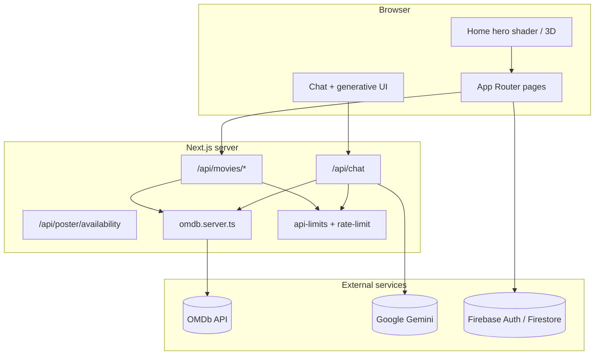

# FlickFocus 🎬

**FlickFocus** is a production-ready movie discovery web app: search the OMDb catalog, save favorites with Firebase Auth, chat with an AI assistant that renders live movie data inline, and explore a cinematic homepage with a GLSL hero shader and optional 3D cinema scene.

<p align="center">
  <a href="https://flickfocus.vercel.app" target="_blank" rel="noopener noreferrer">
    
  </a>
  &nbsp;
  <a href="https://flickfocus.vercel.app/chat" target="_blank" rel="noopener noreferrer">
    
  </a>
</p>

<p align="center">
  <strong>Live Demo / Production URL:</strong>
  <br />
  <a href="https://flickfocus.vercel.app"><code>https://flickfocus.vercel.app</code></a>
</p>

| | |
| --- | --- |
| **Repository** | [github.com/tahatoklucu/FlickFocus-AI-App](https://github.com/tahatoklucu/FlickFocus-AI-App) |
| **Stack** | Next.js 16 (App Router) · Tailwind CSS 4 · Firebase · OMDb · Vercel AI SDK |
| **Repo folder** | `nextjs-ai-app` (GitHub: **FlickFocus-AI-App**) |
| **Status** | Deployed on Vercel · Lighthouse Performance **93+** |

---

## Project Brief

### What problem does it solve?

Choosing what to watch is harder than it should be. Streaming catalogs are vast, recommendation feeds are noisy, and jumping between apps to compare IMDb ratings, cast, and plot details wastes time. FlickFocus addresses the **"what should I watch?"** problem by giving users a fast, focused path from curiosity to a confident pick — with rich OMDb metadata, ratings, and an AI assistant that surfaces live results instead of generic suggestions.

### Who is it for?

FlickFocus is built for **movie lovers**, **series enthusiasts**, and anyone planning a film night who feels overwhelmed by choice. Whether you want a quick genre browse, a deep dive into ratings and cast, or a conversational recommendation, the app meets you where you are.

### Why did we choose this idea?

We wanted to build a **realistic entertainment guide** that combines three things users actually care about: a modern, cinematic interface, AI-powered discovery that pulls real data (not hallucinated titles), and production-grade performance. Movie discovery is a familiar domain with clear UX expectations (search, cards, detail views, watchlists) — making it an ideal capstone to demonstrate full-stack skills, external API integration, auth, and AI tooling in one cohesive product.

---

## Quick start

### Prerequisites

- **Node.js** 20+
- **npm** 10+
- [OMDb API key](http://www.omdbapi.com/apikey.aspx) (free tier)
- [Firebase project](https://console.firebase.google.com/) (Auth + Firestore; Storage optional)
- [Google AI API key](https://aistudio.google.com/apikey) for `/chat` (Gemini)

### Install & run

```bash
git clone https://github.com/tahatoklucu/FlickFocus-AI-App.git
cd FlickFocus-AI-App
npm install
cp .env.example .env.local   # or create .env.local manually (see table below)
npm run dev
```

Open [http://localhost:3000](http://localhost:3000).

### Verify before deploy

```bash
npm run lint
npm run test
npm run build
```

Optional E2E (requires Playwright browser):

```bash
npm run playwright:install
npm run test:e2e
```

### Deploy (Vercel)

1. Push to GitHub and import the repo in [Vercel](https://vercel.com).
2. Add all environment variables from the table below (Production + Preview).
3. Deploy. `NEXT_PUBLIC_APP_URL` should match your production URL for correct OG/metadata.

Firebase rules: `npm run firebase:deploy` (Firestore + Storage rules from `firebase.json`).

**Full signed-off checklist:** [docs/DEPLOYMENT_CHECKLIST.md](./docs/DEPLOYMENT_CHECKLIST.md) (FE-11 — env vars, domain, Firebase, smoke tests, rollback).

---

## Environment variables

Create `.env.local` in the project root. **Never commit secrets.**

| Variable | Required | Scope | Description |
| --- | --- | --- | --- |
| `NEXT_PUBLIC_OMDB_API_KEY` | Yes | Client + Server | OMDb API key for movie search and details |
| `NEXT_PUBLIC_FIREBASE_API_KEY` | Yes* | Client | Firebase Web API key |
| `NEXT_PUBLIC_FIREBASE_AUTH_DOMAIN` | Yes* | Client | e.g. `your-app.firebaseapp.com` |
| `NEXT_PUBLIC_FIREBASE_PROJECT_ID` | Yes* | Client | Firebase project ID |
| `NEXT_PUBLIC_FIREBASE_STORAGE_BUCKET` | Yes* | Client | e.g. `your-app.appspot.com` |
| `NEXT_PUBLIC_FIREBASE_MESSAGING_SENDER_ID` | Yes* | Client | Firebase messaging sender ID |
| `NEXT_PUBLIC_FIREBASE_APP_ID` | Yes* | Client | Firebase app ID |
| `NEXT_PUBLIC_FIREBASE_USE_STORAGE` | No | Client | Set to `true` to enable avatar uploads to Firebase Storage |
| `NEXT_PUBLIC_APP_URL` | Recommended | Client | Canonical site URL (metadata, Open Graph). Default: `http://localhost:3000` |
| `GOOGLE_GENERATIVE_AI_API_KEY` | For chat | **Server only** | Gemini key for `POST /api/chat`. Chat returns 503 if missing |

\*Firebase vars are required for auth, favorites, and profile. The app loads Firebase lazily and shows a configuration message if they are absent.

---

## Features

- **Movie discovery** — Real-time OMDb search, genre chips, paginated results, detail modal
- **FlickFocus AI Chat** — Streaming assistant with server-side tools (`searchMovies`, `getMovieDetails`) and generative UI cards
- **Watchlist & favorites** — Firebase Auth + Firestore per user
- **Cinematic UI** — Dark glassmorphic layout, responsive grids, micro-interactions
- **GLSL hero shader** — Fullscreen fragment shader on the homepage hero ([docs/SHADER_CAPSTONE.md](./docs/SHADER_CAPSTONE.md))
- **3D cinema hero** — Optional procedural Three.js reel (lazy-loaded, reduced-motion fallback)
- **SEO** — Metadata, Open Graph, Twitter cards via `src/lib/metadata.ts`
- **Performance & a11y audit** — See [docs/AUDIT.md](./docs/AUDIT.md)

---

## Architecture overview



### Project structure

```text
src/
├── app/                      # Routes, layouts, API handlers
│   ├── page.tsx              # Homepage (hero + search)
│   ├── chat/                 # AI chat page
│   ├── favorites/            # Protected favorites
│   ├── profile/              # User profile & settings
│   └── api/                  # chat, movies, poster availability
├── components/
│   ├── auth/                 # AuthModal
│   ├── chat/                 # Chat UI + generative tool cards
│   ├── common/               # Shared helpers (DeferredMount)
│   ├── favorites/            # Favorites page client
│   ├── hero/                 # GLSL shader + 3D cinema scene
│   ├── home/                 # Homepage client composition
│   ├── layout/               # Header, Footer, PageHeroGlow
│   ├── movies/               # MovieCard, SearchBar, modals, posters
│   ├── profile/              # Profile page + UserAvatar
│   ├── providers/            # Providers, FirebaseProviders, ConsoleGuard
│   └── ui/                   # Button, AnimatedActionButton
├── context/                  # Auth & favorites React context
├── lib/
│   ├── api/                  # Rate limits & input caps
│   ├── chat/                 # AI tools, prompts, streaming markdown
│   ├── firebase/             # Config, lazy init, Google auth
│   ├── hero/                 # GLSL source, 3D tokens, critical CSS
│   ├── poster/               # Poster URL validation & availability
│   ├── profile/              # Avatar, profile cache, favorites cache
│   └── *.ts                  # Shared: cn, metadata, site, errors
├── services/                 # OMDb client/server + Firestore users/favorites
└── types/                    # Shared TypeScript interfaces

docs/
├── AUDIT.md                  # Performance & a11y audit
└── SHADER_CAPSTONE.md        # GLSL capstone deliverable
```

**Data flow:** Browser components call `/api/*` routes (or client OMDb wrappers). Chat hits Gemini with Zod-validated tools that fetch OMDb on the server. Favorites sync to Firestore after Firebase Auth.

---

## Production security & API hygiene

All API routes export a Vercel **`maxDuration`** ceiling so long-running requests cannot hang serverless workers indefinitely:

| Route | `maxDuration` | Purpose |
| --- | --- | --- |
| `POST /api/chat` | 30s | Streaming Gemini + tool calls |
| `GET /api/movies/search` | 15s | OMDb search proxy |
| `GET /api/movies/[imdbId]` | 15s | Movie detail proxy |
| `GET /api/movies/genre/[genreId]` | 15s | Curated genre lists |
| `GET /api/poster/availability` | 10s | Poster HEAD check |

**Rate limiting** (`src/lib/api/api-rate-limit.ts`): in-memory, per-IP limits (best-effort on serverless — each instance has its own bucket):

| Scope | Limit |
| --- | --- |
| Chat (`POST /api/chat`) | 20 requests / minute / IP |
| Other API routes | 120 requests / minute / IP |

Exceeded limits return **429** with `Retry-After`.

**Input caps** (`src/lib/api/api-limits.ts`):

- Chat: max 40 messages, ~100 KB payload, 4 000 chars per text part
- Search: query trimmed to 120 chars, page clamped 1–5
- IMDb IDs: `tt` + 5–10 digits
- Zod tool schemas mirror the same bounds in `src/lib/chat/chat-tools.ts`

For production at scale, consider Vercel KV / Upstash Redis for distributed rate limits.

---

## Known limitations & future improvements

### Current limitations

| Area | Limitation |
| --- | --- |
| **OMDb API** | Free-tier daily request cap; search/detail depend on external uptime |
| **AI chat** | Requires `GOOGLE_GENERATIVE_AI_API_KEY` (Gemini); returns 503 without it — rest of app still works |
| **Rate limiting** | In-memory, per serverless instance — not a shared Redis/KV store |
| **Genre browse** | Curated IMDb ID lists per genre, not a full OMDb genre API |
| **Favorites** | Requires Firebase Auth + Firestore; no offline sync beyond local cache |
| **Monitoring** | No dedicated APM (Sentry/Datadog); relies on Vercel logs, CI, and `/health-check` |
| **Test coverage** | Strong on chat UI and API guards; not every component has a co-located unit test yet |

### Planned improvements

- **Lighthouse CI** in GitHub Actions to catch performance regressions on every PR
- **Distributed rate limiting** via Vercel KV or Upstash Redis
- **Full WAI-ARIA menu pattern** (arrow-key navigation) on the profile dropdown
- **Expanded unit tests** for movie components (`SearchBar`, `MovieCard`, `FavoriteButton`) — **done (51% component coverage)**
- **axe/WAVE audit artifacts** committed alongside [docs/AUDIT.md](./docs/AUDIT.md)
- **`prefers-reduced-data`** tier — skip heavy environment maps and poster pre-checks on slow connections

See also [docs/AUDIT.md §8](./docs/AUDIT.md#8-future-recommendations) for the full audit backlog.

---

## Rollback plan

If a production deploy breaks a critical flow (search, auth, or chat), roll back immediately via **Vercel → Deployments → select the last known-good build → Promote to Production**. Traffic switches in seconds without a rebuild. After rollback, re-run the smoke tests in [docs/DEPLOYMENT_CHECKLIST.md §6](./docs/DEPLOYMENT_CHECKLIST.md#6-post-deploy-smoke-tests). For code-level fixes, `git revert` the bad commit and push to `main` to trigger a clean redeploy.

---

## AI Integration & Development Process

Artificial intelligence was a **core part of how FlickFocus was built** — not as a replacement for engineering judgment, but as a force multiplier throughout design, implementation, and hardening.

### How AI was used during development

Throughout the project, the **Claude + Cursor** ecosystem was used actively to:

- **Prevent code bloat** — keep components focused, avoid unnecessary abstractions, and favour minimal diffs that solve real problems
- **Maintain modular architecture** — domain-based folders (`components/movies/`, `lib/chat/`, `lib/firebase/`, etc.) with clear separation between client, server, and shared logic
- **Optimize file organization** — consolidate scattered utilities into purposeful modules and keep API routes thin
- **Target Lighthouse performance (93+)** — audit-driven fixes for LCP, caching, lazy loading, hydration safety, and bundle splitting (see [docs/AUDIT.md](./docs/AUDIT.md))

### Role-prompting, not casual prompting

AI was approached less like a generic autocomplete and more like a **lead engineer on the project**. Prompts framed context, constraints, and acceptance criteria explicitly — for example: *"Add server-side OMDb tools with Zod schemas; cap results at 6; render generative UI cards, not raw JSON."* That role-prompting discipline produced higher-quality, review-ready output and reduced rework.

### Runtime AI vs. development AI

| Layer | Technology | Purpose |
| --- | --- | --- |
| **Development** | Cursor IDE + Claude | Architecture, components, refactors, tests, docs |
| **Runtime (in-app)** | Google Gemini via Vercel AI SDK | Streaming chat with live OMDb tool calls |
| **Tooling contract** | Zod-validated server tools | `searchMovies`, `getMovieDetails` → generative UI |

### What AI contributed (by area)

| Area | AI role | Human role |
| --- | --- | --- |
| App scaffold & OMDb layer | App Router layout, client/server split, TypeScript interfaces | Feature scope, naming, final review |
| FlickFocus AI Chat | Chat route, tool schemas, lifecycle UI, generative cards | Tool contracts, result caps, multi-step limits |
| UI / UX | Glassmorphic header, search, movie cards, detail modal | Visual taste, spacing, mobile breakpoints |
| GLSL capstone shader | Fragment shader + WebGL runtime, DPR cap, reduced-motion fallback | Capstone requirements, performance budgets |
| 3D cinema hero | Procedural R3F scene, lazy load, CSS fallback | Device-tier tuning |
| Production hardening | Audit recommendations, rate limits, input caps, poster pre-check | Env setup, deploy checklist, security review |
| Tests | Vitest unit tests, Playwright specs | CI verification, lint fixes |

Every AI-generated change was **reviewed, edited, and tested** (`npm run lint`, `npm run test`, `npm run build`) before merge — never copy-pasted blindly.

### Representative prompts

- *"Add server-side OMDb tools to chat with Zod schemas and generative UI cards."*
- *"Fullscreen GLSL hero with `u_time`, `u_resolution`, `u_mouse`; respect reduced motion."*
- *"Fix hydration mismatch on homepage after hero refactor."*
- *"Add rate limiting and maxDuration before production deploy."*
- *"Reorganize flat components into domain folders without breaking imports."*

---

## Error States & Resilience

Error handling and edge cases were treated as first-class requirements — not afterthoughts. The app is designed to **degrade gracefully** when APIs fail, inputs are invalid, or optional services (Firebase, chat) are unavailable.

### API & network resilience

| Scenario | Behaviour |
| --- | --- |
| OMDb timeout / failure | Typed `OMDbError` messages; search and detail views show user-friendly errors, not crashes |
| Invalid search query / page | `400` with clear message; query length and page number clamped server-side |
| Rate limit exceeded | `429 Too Many Requests` with `Retry-After` header |
| Chat API misconfigured | `503` when `GOOGLE_GENERATIVE_AI_API_KEY` is missing |
| Oversized chat payload | Rejected before hitting the model (`400` with validation message) |
| Invalid IMDb ID | `400` / `404` with safe error body |

### UI-level error states

- **Chat tool failures** — `ChatToolOutputError` renders a red error card; the session continues (no white-screen crash)
- **Movie not found** — dedicated `MovieNotFound` component inside the detail modal
- **Missing posters** — availability pre-check via `/api/poster/availability`; placeholder shown instead of broken images
- **AnimatedActionButton** — explicit `error` / `retry` visual state for failed actions (chat send, profile save)
- **Global error boundary** — `src/app/error.tsx` for unexpected runtime failures
- **404 page** — `src/app/not-found.tsx` with branded messaging and navigation

### Optional service degradation

- **Firebase not configured** — lazy load skipped; placeholder auth provider; configuration message instead of crash
- **3D / WebGL unavailable** — static CSS `CinemaHeroFallback` when `prefers-reduced-motion` is active
- **GLSL shader** — reduced-motion users get a static gradient backdrop; tab-hidden pauses animation

### Validation & defensive coding

- Zod schemas on AI tool inputs (query length, IMDb ID format)
- Shared input caps in `src/lib/api/api-limits.ts`
- Type guards for poster URLs (`isValidPosterUrl`)
- Firestore / Storage errors mapped to readable messages via `src/lib/errors.ts`

The system is built to **recover and inform**, not fail silently or expose raw stack traces to users.

---

## Testing Evidence

Component tests and critical user-flow tests were written to keep FlickFocus reliable as features evolved. **Detailed test files and coverage scope are documented in the repository** through co-located Vitest/Playwright suites, shared fixtures, and the CI workflow below.

### What is tested

| Layer | Scope | Location |
| --- | --- | --- |
| **Unit — movies** | Search, favorites, cards, list, poster, not-found | `src/components/movies/*.test.tsx` |
| **Unit — chat UI** | Tool lifecycle, generative movie cards, assistant message rendering | `src/components/chat/*.test.tsx` |
| **Unit — layout/home** | Footer, hero glow, loading skeleton, deferred mount | `src/components/layout/*.test.tsx`, etc. |
| **Unit — interactions** | `AnimatedActionButton` states (idle, loading, success, error/retry) | `src/components/ui/AnimatedActionButton.test.tsx` |
| **Unit — AI tools** | OMDb tool `execute` functions, result shaping | `src/lib/chat/chat-tools.test.ts` |
| **Unit — API guards** | Input caps, IMDb ID validation, rate limiting | `src/lib/api/api-limits.test.ts` |
| **Unit — posters** | Poster URL validation type guard | `src/lib/poster/poster-url.test.ts` |
| **E2E — chat flow** | Send message → streamed assistant reply (mocked SSE) | `e2e/chat.spec.ts` |
| **Fixtures** | Shared chat SSE / tool output mocks | `src/test/fixtures/chat.ts` |

### Current test inventory

```text
npm run test            → 73 unit tests across 26 files
npm run test:coverage   → Vitest v8 report + docs/coverage-summary.json
npm run test:e2e        → Playwright chat user-flow spec
npm run lint            → ESLint (runs in CI before tests)
```

**Component file coverage: 23 / 45 (51%)** — meets capstone ≥50% target.  
Full evidence: **[docs/TEST_COVERAGE.md](./docs/TEST_COVERAGE.md)** · [`docs/coverage-summary.json`](./docs/coverage-summary.json)

### CI pipeline

Automated checks run on every push/PR via [`.github/workflows/test.yml`](./.github/workflows/test.yml):

1. **Lint** → `npm run lint`
2. **Unit tests** → `npm run test`
3. **Production build** → `npm run build`
4. **E2E** → `npm run test:e2e` (Playwright; report artifact uploaded on failure)

### How to reproduce locally

```bash
npm run lint
npm run test
npm run test:coverage
npm run test:e2e        # optional: requires Playwright browser (npm run playwright:install)
```

> **Note:** Vitest is configured in [`vitest.config.ts`](./vitest.config.ts) with jsdom and path aliases matching the Next.js app. Playwright config: [`playwright.config.ts`](./playwright.config.ts). Coverage evidence: [`docs/TEST_COVERAGE.md`](./docs/TEST_COVERAGE.md).

---

## Performance & Accessibility Audit

Lighthouse **mobile** audits and accessibility reviews were conducted on a production build. Scores improved from a **Performance 44** baseline to **93+** after targeted optimizations documented in full.

### Lighthouse results (after optimizations)

| Category | Before | After |
| --- | ---: | ---: |
| **Performance** | 44 | **93** |
| **Accessibility** | ~85 | **96** |
| **Best Practices** | ~90 | **100** |
| **SEO** | ~92 | **100** |

Key Core Web Vitals gains: **LCP 9.0 s → 3.1 s**, **TBT 3,270 ms → 150 ms**, **CLS ~0.15 → 0.021**.

### Full audit documentation

All concrete improvements, before/after tables, keyboard navigation checklist, and verification commands are recorded in:

**[docs/AUDIT.md](./docs/AUDIT.md)** — official accessibility & performance audit for the FlickFocus capstone

The audit covers:

- 3D hero lazy-loading, Firebase deferral, image/LCP tuning, critical CSS inlining
- Skip link, focus traps, modal accessibility, chat `aria-live` patterns
- Local Lighthouse reproduction steps (`npm run build && npm run start`)
- GLSL capstone shader performance notes (§9)

### Related capstone evidence

| Document | Contents |
| --- | --- |
| [docs/AUDIT.md](./docs/AUDIT.md) | Lighthouse scores, CWV metrics, a11y checklist, optimization reference |
| [docs/SHADER_CAPSTONE.md](./docs/SHADER_CAPSTONE.md) | GLSL hero shader deliverable (uniforms, DPR cap, reduced-motion fallback) |

To regenerate Lighthouse evidence locally:

```bash
npm run build && npm run start -- -p 3001
# Chrome DevTools → Lighthouse → Mobile → http://localhost:3001
```

See **§6 Local Verification** in [docs/AUDIT.md](./docs/AUDIT.md) for CLI commands and detailed steps.

---

Recent history mixes informal messages (`ui update`, `vercel fix`) with occasional descriptive ones. **Going forward**, use [Conventional Commits](https://www.conventionalcommits.org/):

```text
feat: add poster availability API
fix: resolve hydration mismatch on homepage hero
docs: expand README with env table and AI section
perf: cap hero shader DPR on mobile
test: add api-limits unit tests
```

Types: `feat`, `fix`, `docs`, `style`, `refactor`, `perf`, `test`, `chore`. Keep subject ≤ 72 chars; add body for *why* when helpful.

---

## GLSL Hero Shader (Capstone)

See **[docs/SHADER_CAPSTONE.md](./docs/SHADER_CAPSTONE.md)** for live URL notes, shader source (`src/lib/hero/hero-shader.ts`), uniforms, and fallbacks.

**Homepage stack:** `HomePageHero` → `HomeHeroBackdropShell` + `HeroShaderBackground` → headline & search on top.

---

## AI tool contract (chat)

FlickFocus exposes **server-side AI tools** on `POST /api/chat`. Tools fetch live OMDb data and stream typed UI parts (`tool-searchMovies`, `tool-getMovieDetails`).

### Tool lifecycle

| State | UI |
| --- | --- |
| `input-streaming` | Amber — parameters streaming |
| `input-available` | Sky — executing |
| `output-available` | Emerald — generative result |
| `output-error` | Red — `ChatToolOutputError` |

### Tools

**`searchMovies`** — Input: `query` (string, 1–120 chars). Returns up to 6 hits + `totalResults`. UI: `ChatMovieSearchResults`.

**`getMovieDetails`** — Input: `imdbID` (`tt` + digits). Returns full metadata. UI: `ChatMovieDetailCard`.

| Concern | Location |
| --- | --- |
| Tool definitions | `src/lib/chat/chat-tools.ts` |
| Types | `src/types/chat-tools.ts` |
| Chat API | `src/app/api/chat/route.ts` |
| Generative UI | `src/components/chat/*` |

---

## Micro-interactions: Animated Action Button

Reusable **`AnimatedActionButton`** (`src/components/ui/AnimatedActionButton.tsx`) — compositor-friendly states: idle, loading, success, error/retry. Tokens in `src/lib/animated-action-button.ts`; respects `prefers-reduced-motion`.

---

## Web 3D Experience (Cinema Hero)

Procedural film reel (no external GLB) via Three.js / R3F / Drei. Lazy-loaded; desktop gets bloom/fog; mobile lighter tier; **`prefers-reduced-motion`** → static `CinemaHeroFallback`.

| Concern | Location |
| --- | --- |
| Lazy entry | `src/components/hero/CinemaHeroExperience.tsx` |
| Scene | `src/components/hero/CinemaHeroScene.tsx` |
| Tokens | `src/lib/hero/cinema-hero-3d.ts` |

---

## Scripts reference

| Command | Description |
| --- | --- |
| `npm run dev` | Development server |
| `npm run build` | Production build |
| `npm run start` | Serve production build |
| `npm run lint` | ESLint |
| `npm run test` | Vitest unit tests |
| `npm run test:coverage` | Unit tests + component coverage report |
| `npm run test:e2e` | Playwright E2E |
| `npm run firebase:deploy` | Deploy Firestore + Storage rules |

---

## Reflection

*Capstone reflection — FlickFocus internship project.*

### Who this project serves

FlickFocus is built for people who want to discover films or series but struggle to decide what to watch. It targets users who feel lost among hundreds of titles and need a fast way to compare IMDb ratings, cast, plot details, and genre context before committing to a movie night. In short, the app addresses the **recommendation and evaluation problem** — helping users move from *"what should I watch?"* to an informed, confident choice.

### How AI shaped the build process

During development, AI (Claude via the Cursor ecosystem) was used deliberately — not to generate code blindly, but to **refine architecture, tighten performance, and keep the codebase lean**. Concrete uses included:

- Deepening feature implementations without unnecessary complexity
- Driving performance optimizations that contributed to Lighthouse scores of 93+
- Reorganizing files into a clear, domain-based structure
- Trimming bloated code paths and keeping components focused
- Iterating toward stronger UI patterns (layout, spacing, responsive behaviour)

The goal was always the same: a modular, maintainable codebase with a polished user experience — not a pile of AI-generated files nobody could navigate.

### Error handling & resilience

Error states were treated as a first-class requirement throughout the project. API failures, invalid inputs, missing posters, and optional service outages (Firebase, chat) are handled with user-facing messages, safe fallbacks, and graceful degradation. At the time of submission, **error flows behave as intended** — the application recovers and informs rather than crashing or exposing raw failures. See [Error States & Resilience](#error-states--resilience) and [docs/AUDIT.md](./docs/AUDIT.md) for the full picture.

### What was hardest — and why

Two areas stood out:

**1. Performance flow end-to-end**  
Making the homepage feel cinematic *without* sacrificing Core Web Vitals was genuinely difficult. The GLSL hero shader, lazy-loaded 3D scene, Firebase auth, and image-heavy movie grid all compete for the main thread and GPU budget. Balancing visual impact with LCP, TBT, and CLS required multiple audit cycles — deferring Three.js, inlining critical CSS, capping shader DPR, and pre-checking poster availability before rendering `<Image>` components.

**2. Search UX — text query vs. genre chips**  
The homepage supports two discovery modes that feel similar to users but behave differently under the hood: **free-text search by title** in the search bar versus **category-based browsing** via genre chip buttons. Wiring both flows cleanly — shared result rendering, distinct API paths, consistent empty/error states, and clear visual hierarchy — took more iteration than expected. Getting the interaction model right (search icon removed, centered layout, left-aligned chips) required several rounds of feedback and refinement.

### What surprised me

The biggest surprise was how much **prompt engineering** changed the quality of AI-assisted development. Early on, I treated Claude like a casual helper — vague requests produced vague code. Once I shifted to **role-prompting** — framing Claude as a lead engineer on the project, with explicit constraints, acceptance criteria, and file boundaries — the output became dramatically more useful. Instead of chatting like a normal user, I structured instructions the way I'd brief a senior teammate: *what*, *why*, *where*, and *what not to touch*. That mindset — engineer-to-engineer, not user-to-chatbot — was the single most valuable skill I picked up during this capstone.

### What I would do differently next time

- **Define search/browse interaction models earlier** — sketch the dual discovery flow (text vs. genre) in wireframes before implementation to reduce UI rework.
- **Run Lighthouse after every major feature merge** — not just at the end — to catch performance regressions from hero/shader changes sooner.
- **Add component tests incrementally** — co-locate tests when each feature ships rather than batching them before submission.

---

## Related docs

- [docs/TEST_COVERAGE.md](./docs/TEST_COVERAGE.md) — Test coverage evidence (51% component files)
- [docs/DEPLOYMENT_CHECKLIST.md](./docs/DEPLOYMENT_CHECKLIST.md) — FE-11 deployment checklist (env, domain, Firebase, smoke tests, rollback)
- [docs/AUDIT.md](./docs/AUDIT.md) — Performance, accessibility, and SEO audit
- [docs/SHADER_CAPSTONE.md](./docs/SHADER_CAPSTONE.md) — GLSL capstone deliverable
- [CLAUDE.md](./CLAUDE.md) — Developer commands & guidelines
- **Reflection** — see [Reflection](#reflection) above

---

## License

Private internship / capstone project. All rights reserved unless otherwise specified by your institution.
