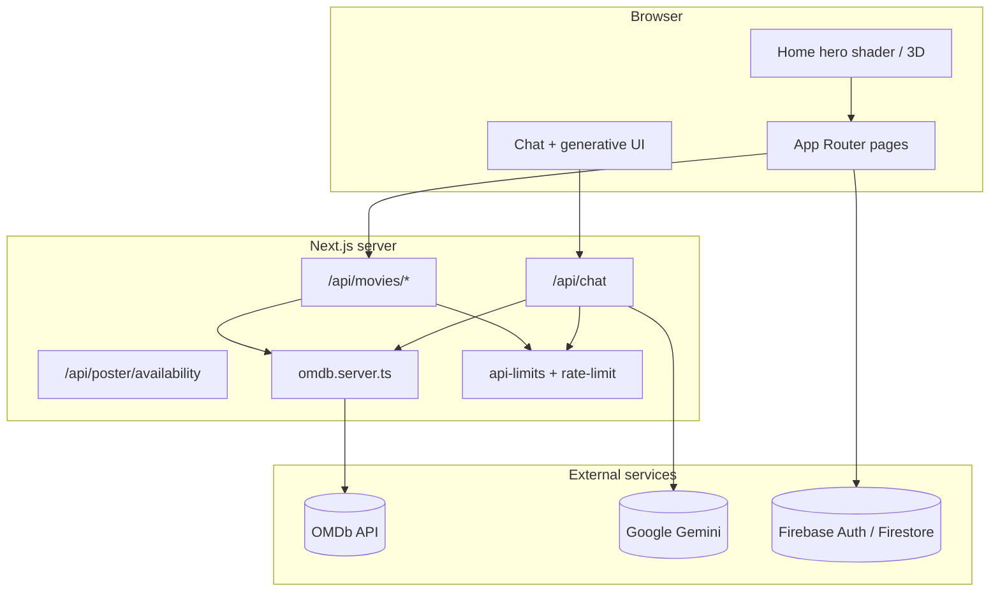

# FlickFocus 🎬

**FlickFocus** is a production-ready movie discovery web app: search the OMDb catalog, save favorites with Firebase Auth, chat with an AI assistant that renders live movie data inline, and explore a cinematic homepage with a GLSL hero shader and optional 3D cinema scene.

| | |
| --- | --- |
| **Live demo** | [https://flickfocus.vercel.app](https://flickfocus.vercel.app) |
| **Stack** | Next.js 16 (App Router) · Tailwind CSS 4 · Firebase · OMDb · Vercel AI SDK |
| **Repo name** | `nextjs-ai-app` (internship project: **FlickFocus-AI-App**) |

---

## Quick start

### Prerequisites

- **Node.js** 20+
- **npm** 10+
- [OMDb API key](http://www.omdbapi.com/apikey.aspx) (free tier)
- [Firebase project](https://console.firebase.google.com/) (Auth + Firestore; Storage optional)
- [Google AI API key](https://aistudio.google.com/apikey) for `/chat` (Gemini)

### Install & run

```bash
git clone <your-repo-url>
cd nextjs-ai-app
npm install
cp .env.example .env.local   # or create .env.local manually (see table below)
npm run dev
```

Open [http://localhost:3000](http://localhost:3000).

### Verify before deploy

```bash
npm run lint
npm run test
npm run build
```

Optional E2E (requires Playwright browser):

```bash
npm run playwright:install
npm run test:e2e
```

### Deploy (Vercel)

1. Push to GitHub and import the repo in [Vercel](https://vercel.com).
2. Add all environment variables from the table below (Production + Preview).
3. Deploy. `NEXT_PUBLIC_APP_URL` should match your production URL for correct OG/metadata.

Firebase rules: `npm run firebase:deploy` (Firestore + Storage rules from `firebase.json`).

---

## Environment variables

Create `.env.local` in the project root. **Never commit secrets.**

| Variable | Required | Scope | Description |
| --- | --- | --- | --- |
| `NEXT_PUBLIC_OMDB_API_KEY` | Yes | Client + Server | OMDb API key for movie search and details |
| `NEXT_PUBLIC_FIREBASE_API_KEY` | Yes* | Client | Firebase Web API key |
| `NEXT_PUBLIC_FIREBASE_AUTH_DOMAIN` | Yes* | Client | e.g. `your-app.firebaseapp.com` |
| `NEXT_PUBLIC_FIREBASE_PROJECT_ID` | Yes* | Client | Firebase project ID |
| `NEXT_PUBLIC_FIREBASE_STORAGE_BUCKET` | Yes* | Client | e.g. `your-app.appspot.com` |
| `NEXT_PUBLIC_FIREBASE_MESSAGING_SENDER_ID` | Yes* | Client | Firebase messaging sender ID |
| `NEXT_PUBLIC_FIREBASE_APP_ID` | Yes* | Client | Firebase app ID |
| `NEXT_PUBLIC_FIREBASE_USE_STORAGE` | No | Client | Set to `true` to enable avatar uploads to Firebase Storage |
| `NEXT_PUBLIC_APP_URL` | Recommended | Client | Canonical site URL (metadata, Open Graph). Default: `http://localhost:3000` |
| `GOOGLE_GENERATIVE_AI_API_KEY` | For chat | **Server only** | Gemini key for `POST /api/chat`. Chat returns 503 if missing |

\*Firebase vars are required for auth, favorites, and profile. The app loads Firebase lazily and shows a configuration message if they are absent.

---

## Features

- **Movie discovery** — Real-time OMDb search, genre chips, paginated results, detail modal
- **FlickFocus AI Chat** — Streaming assistant with server-side tools (`searchMovies`, `getMovieDetails`) and generative UI cards
- **Watchlist & favorites** — Firebase Auth + Firestore per user
- **Cinematic UI** — Dark glassmorphic layout, responsive grids, micro-interactions
- **GLSL hero shader** — Fullscreen fragment shader on the homepage hero ([docs/SHADER_CAPSTONE.md](./docs/SHADER_CAPSTONE.md))
- **3D cinema hero** — Optional procedural Three.js reel (lazy-loaded, reduced-motion fallback)
- **SEO** — Metadata, Open Graph, Twitter cards via `src/lib/metadata.ts`
- **Performance & a11y audit** — See [docs/AUDIT.md](./docs/AUDIT.md)

---

## Architecture overview



### Project structure

```text
src/
├── app/                      # Routes, layouts, API handlers
│   ├── page.tsx              # Homepage (hero + search)
│   ├── chat/                 # AI chat page
│   ├── favorites/            # Protected favorites
│   ├── profile/              # User profile & settings
│   └── api/                  # chat, movies, poster availability
├── components/
│   ├── auth/                 # AuthModal
│   ├── chat/                 # Chat UI + generative tool cards
│   ├── common/               # Shared helpers (DeferredMount)
│   ├── favorites/            # Favorites page client
│   ├── hero/                 # GLSL shader + 3D cinema scene
│   ├── home/                 # Homepage client composition
│   ├── layout/               # Header, Footer, PageHeroGlow
│   ├── movies/               # MovieCard, SearchBar, modals, posters
│   ├── profile/              # Profile page + UserAvatar
│   ├── providers/            # Providers, FirebaseProviders, ConsoleGuard
│   └── ui/                   # Button, AnimatedActionButton
├── context/                  # Auth & favorites React context
├── lib/
│   ├── api/                  # Rate limits & input caps
│   ├── chat/                 # AI tools, prompts, streaming markdown
│   ├── firebase/             # Config, lazy init, Google auth
│   ├── hero/                 # GLSL source, 3D tokens, critical CSS
│   ├── poster/               # Poster URL validation & availability
│   ├── profile/              # Avatar, profile cache, favorites cache
│   └── *.ts                  # Shared: cn, metadata, site, errors
├── services/                 # OMDb client/server + Firestore users/favorites
└── types/                    # Shared TypeScript interfaces

docs/
├── AUDIT.md                  # Performance & a11y audit
└── SHADER_CAPSTONE.md        # GLSL capstone deliverable
```

**Data flow:** Browser components call `/api/*` routes (or client OMDb wrappers). Chat hits Gemini with Zod-validated tools that fetch OMDb on the server. Favorites sync to Firestore after Firebase Auth.

---

## Production security & API hygiene

All API routes export a Vercel **`maxDuration`** ceiling so long-running requests cannot hang serverless workers indefinitely:

| Route | `maxDuration` | Purpose |
| --- | --- | --- |
| `POST /api/chat` | 30s | Streaming Gemini + tool calls |
| `GET /api/movies/search` | 15s | OMDb search proxy |
| `GET /api/movies/[imdbId]` | 15s | Movie detail proxy |
| `GET /api/movies/genre/[genreId]` | 15s | Curated genre lists |
| `GET /api/poster/availability` | 10s | Poster HEAD check |

**Rate limiting** (`src/lib/api/api-rate-limit.ts`): in-memory, per-IP limits (best-effort on serverless — each instance has its own bucket):

| Scope | Limit |
| --- | --- |
| Chat (`POST /api/chat`) | 20 requests / minute / IP |
| Other API routes | 120 requests / minute / IP |

Exceeded limits return **429** with `Retry-After`.

**Input caps** (`src/lib/api/api-limits.ts`):

- Chat: max 40 messages, ~100 KB payload, 4 000 chars per text part
- Search: query trimmed to 120 chars, page clamped 1–5
- IMDb IDs: `tt` + 5–10 digits
- Zod tool schemas mirror the same bounds in `src/lib/chat/chat-tools.ts`

For production at scale, consider Vercel KV / Upstash Redis for distributed rate limits.

---

## How AI tools built this

This section documents **how AI-assisted development was used** on FlickFocus — transparently, for internship review.

### Tools used

| Tool | Role |
| --- | --- |
| **Cursor IDE + Claude** | Primary pair-programming assistant: architecture, components, debugging, refactors |
| **Google Gemini** | Runtime model for `/api/chat` (not the IDE assistant) |
| **Vercel AI SDK** | Streaming chat, tool calling, generative UI message parts |

### What AI helped build (by area)

**1. Application scaffold & conventions**  
AI suggested the App Router layout (`src/app/*`), separation of `services/omdb.server.ts` vs client wrappers, and TypeScript interfaces for OMDb responses. Human decisions: feature scope, naming (FlickFocus), and final file ownership.

**2. FlickFocus AI Chat & generative UI**  
AI drafted the chat route, Zod tool definitions (`src/lib/chat/chat-tools.ts`), system prompt, and tool lifecycle UI (`ChatToolLifecycle`, `ChatToolInvocation`, movie result cards). The developer reviewed tool contracts, capped result sets (6 search hits), and wired `stopWhen: isStepCount(5)` for multi-step tool chains.

**3. UI/UX & responsive design**  
AI iterated on glassmorphic header, search bar, movie cards, and `MovieDetailModal` aspect ratios. Several rounds of human feedback adjusted spacing, genre chip alignment, hero centering, and mobile breakpoints.

**4. GLSL capstone shader**  
AI helped author the fragment shader in `src/lib/hero/hero-shader.ts` and the WebGL runtime (`HeroShaderBackground.tsx`): uniforms (`u_time`, `u_resolution`, `u_mouse`), DPR cap, tab visibility pause, and `prefers-reduced-motion` CSS fallback. Documented in [docs/SHADER_CAPSTONE.md](./docs/SHADER_CAPSTONE.md).

**5. 3D cinema hero**  
AI generated the procedural Three.js scene (R3F + Drei), lazy `dynamic()` loading, device-tier effects, and static CSS fallback — with human tuning of performance budgets.

**6. Performance & production hardening**  
AI produced [docs/AUDIT.md](./docs/AUDIT.md) recommendations (Lighthouse, LCP, cache headers). Fixes included: production-only aggressive caching in `next.config.ts`, client-only homepage bundle (`HomePageClientRoot`), poster availability pre-check to avoid console 404s, Firebase lazy hydration, and the rate limiting / input caps in this README.

**7. Tests & CI**  
AI added Vitest unit tests (chat tools, poster URL guard, API limits) and Playwright specs; developer ran `npm run lint` / `npm run test` before deploy and fixed ESLint rule violations (e.g. `react-hooks/set-state-in-effect` in `Providers.tsx`).

### What remained human-led

- Product goals (movie app + AI chat + internship capstone requirements)
- API key management and Vercel/Firebase project setup
- Visual taste and acceptance criteria (“revert old search UI”, “no search icon”, etc.)
- Final review of security limits, env vars, and deployment checklist
- Honest documentation (this section)

### Prompting approach (representative)

- *“Add server-side OMDb tools to chat with Zod schemas and generative UI cards.”*
- *“Fullscreen GLSL hero with u_time, u_resolution, u_mouse; respect reduced motion.”*
- *“Fix hydration mismatch on homepage after hero refactor.”*
- *“Add rate limiting and maxDuration before production deploy.”*

AI outputs were **always reviewed, edited, and tested** before merge — not copy-pasted blindly.

---

## Git commit conventions

Recent history mixes informal messages (`ui update`, `vercel fix`) with occasional descriptive ones. **Going forward**, use [Conventional Commits](https://www.conventionalcommits.org/):

```text
feat: add poster availability API
fix: resolve hydration mismatch on homepage hero
docs: expand README with env table and AI section
perf: cap hero shader DPR on mobile
test: add api-limits unit tests
```

Types: `feat`, `fix`, `docs`, `style`, `refactor`, `perf`, `test`, `chore`. Keep subject ≤ 72 chars; add body for *why* when helpful.

---

## GLSL Hero Shader (Capstone)

See **[docs/SHADER_CAPSTONE.md](./docs/SHADER_CAPSTONE.md)** for live URL notes, shader source (`src/lib/hero/hero-shader.ts`), uniforms, and fallbacks.

**Homepage stack:** `HomePageHero` → `HomeHeroBackdropShell` + `HeroShaderBackground` → headline & search on top.

---

## AI tool contract (chat)

FlickFocus exposes **server-side AI tools** on `POST /api/chat`. Tools fetch live OMDb data and stream typed UI parts (`tool-searchMovies`, `tool-getMovieDetails`).

### Tool lifecycle

| State | UI |
| --- | --- |
| `input-streaming` | Amber — parameters streaming |
| `input-available` | Sky — executing |
| `output-available` | Emerald — generative result |
| `output-error` | Red — `ChatToolOutputError` |

### Tools

**`searchMovies`** — Input: `query` (string, 1–120 chars). Returns up to 6 hits + `totalResults`. UI: `ChatMovieSearchResults`.

**`getMovieDetails`** — Input: `imdbID` (`tt` + digits). Returns full metadata. UI: `ChatMovieDetailCard`.

| Concern | Location |
| --- | --- |
| Tool definitions | `src/lib/chat/chat-tools.ts` |
| Types | `src/types/chat-tools.ts` |
| Chat API | `src/app/api/chat/route.ts` |
| Generative UI | `src/components/chat/*` |

---

## Micro-interactions: Animated Action Button

Reusable **`AnimatedActionButton`** (`src/components/ui/AnimatedActionButton.tsx`) — compositor-friendly states: idle, loading, success, error/retry. Tokens in `src/lib/animated-action-button.ts`; respects `prefers-reduced-motion`.

---

## Web 3D Experience (Cinema Hero)

Procedural film reel (no external GLB) via Three.js / R3F / Drei. Lazy-loaded; desktop gets bloom/fog; mobile lighter tier; **`prefers-reduced-motion`** → static `CinemaHeroFallback`.

| Concern | Location |
| --- | --- |
| Lazy entry | `src/components/hero/CinemaHeroExperience.tsx` |
| Scene | `src/components/hero/CinemaHeroScene.tsx` |
| Tokens | `src/lib/cinema-hero-3d.ts` |

---

## Scripts reference

| Command | Description |
| --- | --- |
| `npm run dev` | Development server |
| `npm run build` | Production build |
| `npm run start` | Serve production build |
| `npm run lint` | ESLint |
| `npm run test` | Vitest unit tests |
| `npm run test:e2e` | Playwright E2E |
| `npm run firebase:deploy` | Deploy Firestore + Storage rules |

---

## Related docs

- [docs/AUDIT.md](./docs/AUDIT.md) — Performance, accessibility, and SEO audit
- [docs/SHADER_CAPSTONE.md](./docs/SHADER_CAPSTONE.md) — GLSL capstone deliverable
- [CLAUDE.md](./CLAUDE.md) — Developer commands & guidelines

---

## License

Private internship / capstone project. All rights reserved unless otherwise specified by your institution.
